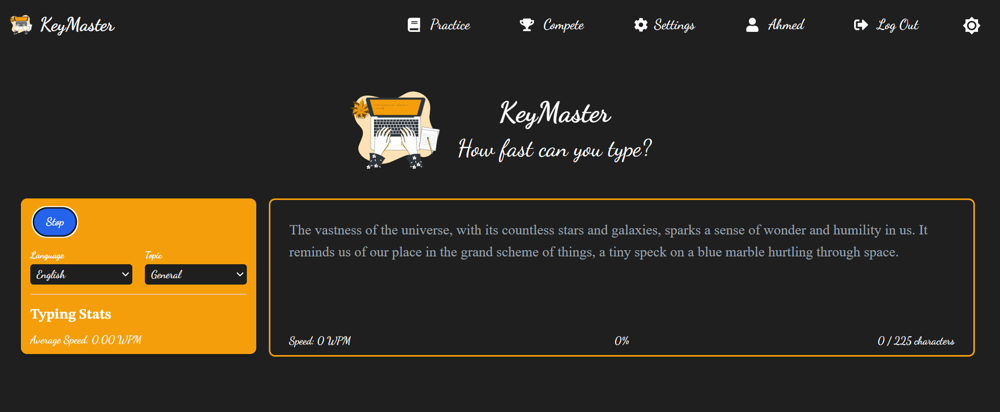
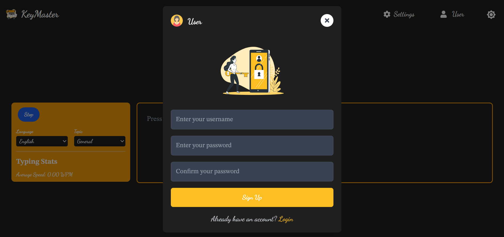
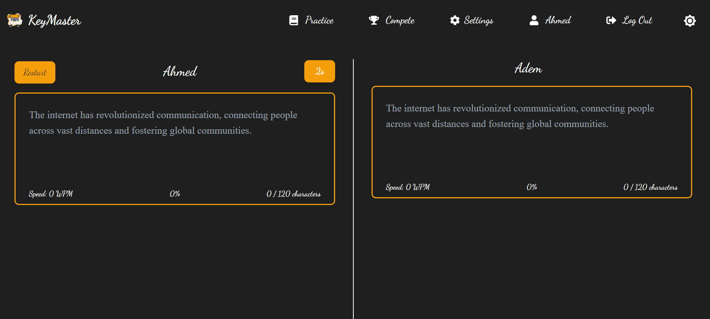
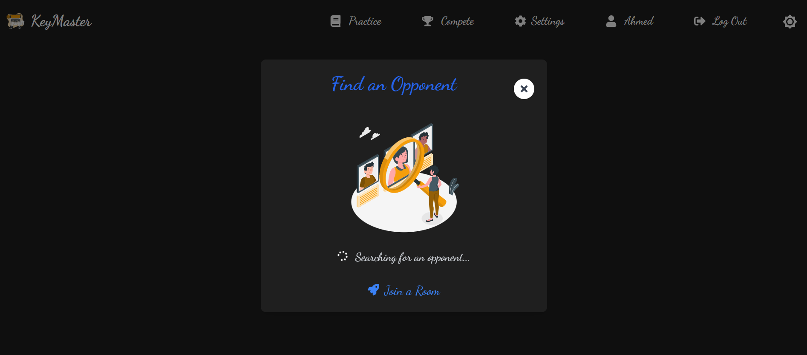
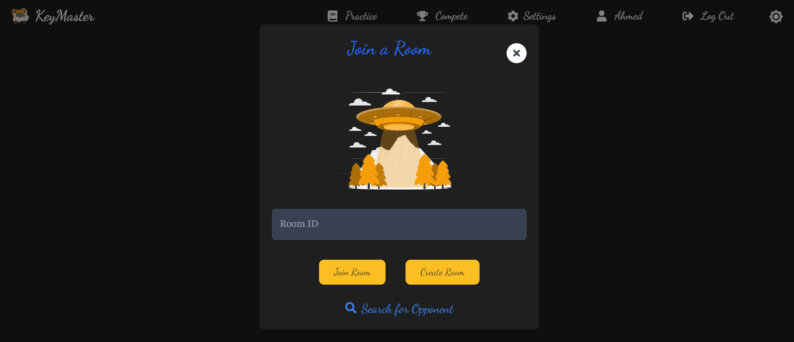
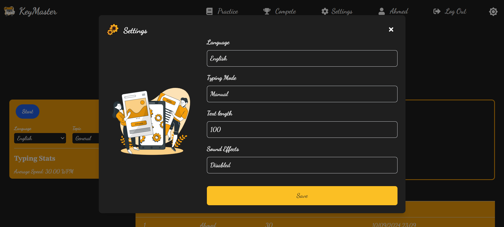

# KeyMaster

**KeyMaster** is a lightweight, responsive web app designed to enhance typing practice through real-time competition, personalized settings, and a built-in leaderboard. This app is tailored for users looking to improve their typing speed and accuracy in a fun, competitive environment. 

[Live Demo](http://keymaster-type.vercel.app) | [GitHub Repository](https://github.com/ahmedrioueche/keymaster)

---

## Table of Contents

- [Overview](#overview)
- [Tech Stack](#tech-stack)
- [Features](#features)
- [Screenshots](#screenshots)
- [Conclusion](#conclusion)
- [Links](#links)

---

## Overview

KeyMaster provides an interactive and engaging typing experience by leveraging Gemini to fetch training paragraphs based on user preferences. It offers real-time performance metrics like speed, character count, and timing, allowing users to improve their typing skills with instant feedback.

---

## Tech Stack

- **Frontend**: Next.js, TypeScript, React.js, Tailwind CSS
- **Backend**: Prisma, PostgreSQL, Supabase, Pusher
- **Authentication**: Bcrypt
- **Deployment**: Vercel
- **Additional Services**: Gemini (for paragraph fetching)

---

## Features

- **Typing Practice**: Choose topics and languages, and get personalized typing practice paragraphs.
- **Leaderboard**: Compete with others in real-time and see how you rank globally.
- **Real-time Competition**: Challenge friends or random players in real-time typing games.
- **Custom Settings**: Personalize your typing experience with customizable settings (stored in Supabase).
- **User Authentication**: Sign up, log in, and manage your profile.
- **Room Creation & Search**: Create rooms, join friends, and search for competitors with a custom search algorithm.

---

## Screenshots

1.   
   **Home Screen**: Users can select a topic and language, then start typing as Gemini provides a paragraph of the specified length. Performance metrics such as speed, character count, and timer provide real-time feedback.

2.   
   **Login Screen**: Users must log in to access personalized settings and the leaderboard.

3.   
   **Signup Screen**: New users can easily register with a simple form. User data is managed through Supabase and Prisma.

4.   
   **Real-time Competition**: Users can compete against friends or other players in typing challenges, with Pusher managing real-time communication.

5.   
   **Search Functionality**: Users can search for specific games or competitors using a fast and accurate custom search algorithm.

6.   
   **Join/Create Rooms**: Users can create rooms or join friends' rooms, with room data managed in a PostgreSQL database.

7.   
   **Settings Screen**: Users can configure their preferences, such as language and typing mode, with settings stored in Supabase for persistent user profiles.

---

## Conclusion

KeyMaster is an engaging typing game that encourages efficiency, competition, and improvement. Future plans include incorporating Google Ads for monetization.

---

## Links

- **Live Demo**: [KeyMaster](http://keymaster-type.vercel.app)
- **GitHub Repository**: [KeyMaster Repository](https://github.com/ahmedrioueche/keymaster)
- **Project Details**: [More Details](./projects/3)
